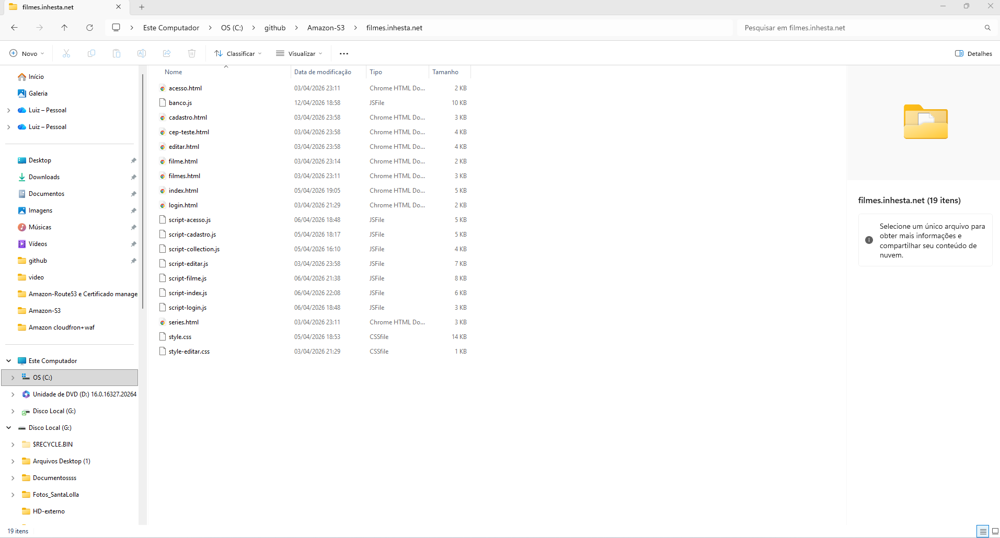
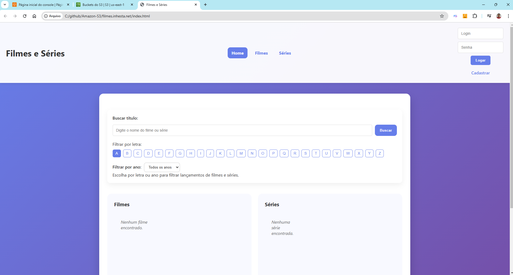
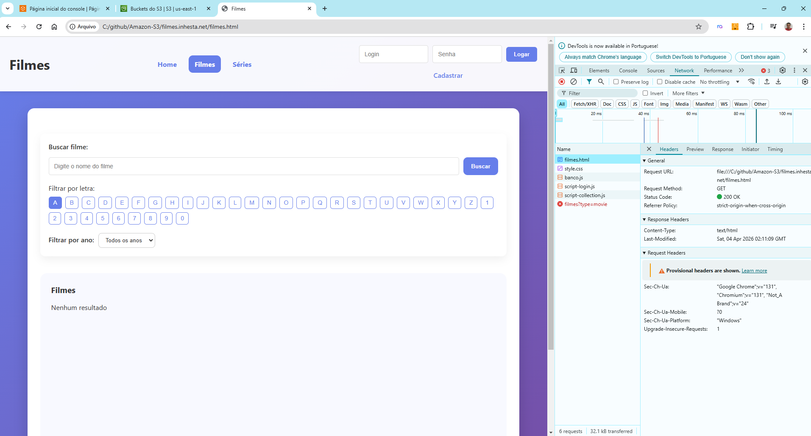
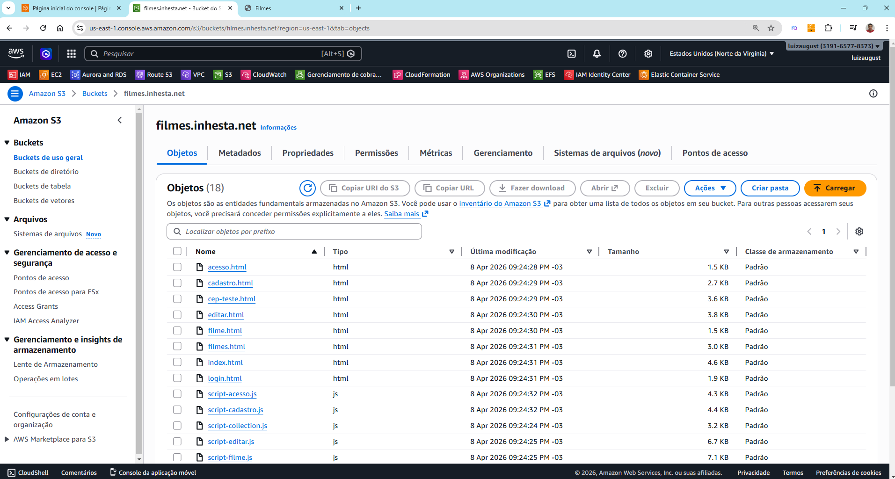
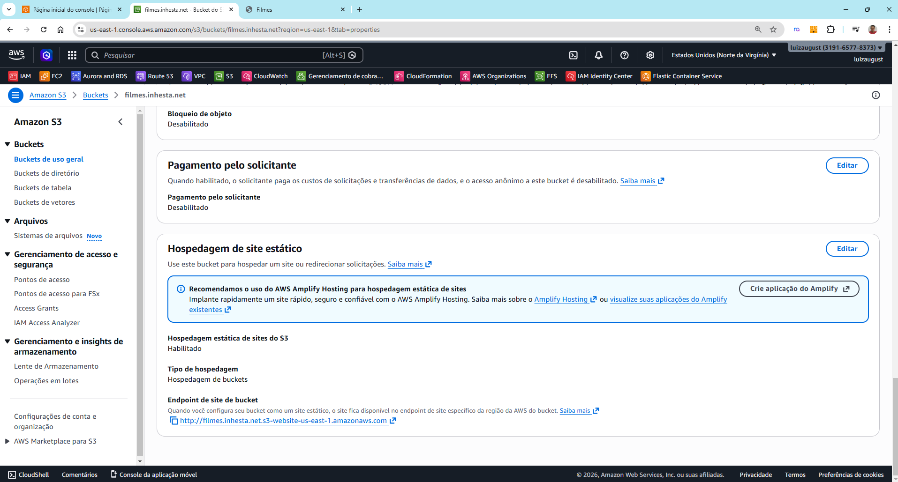
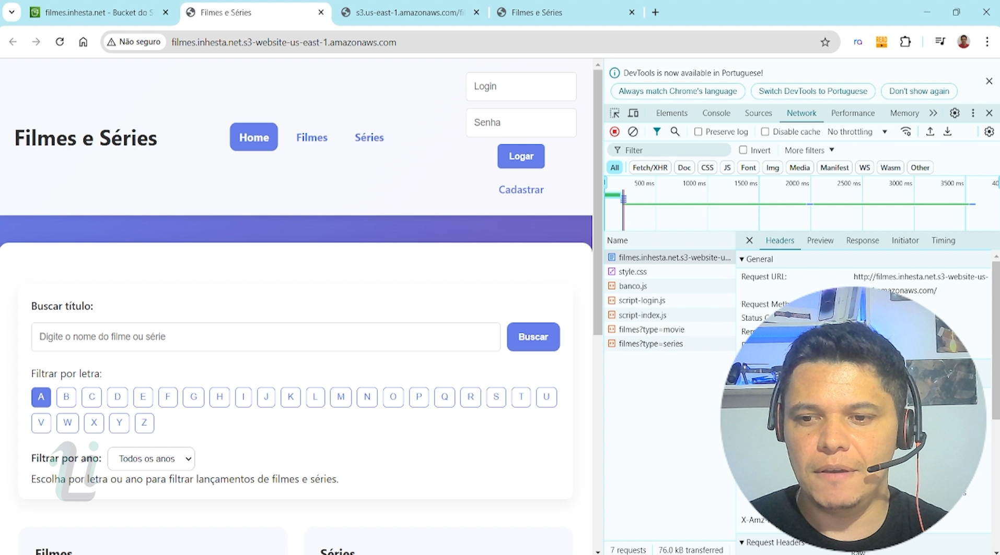
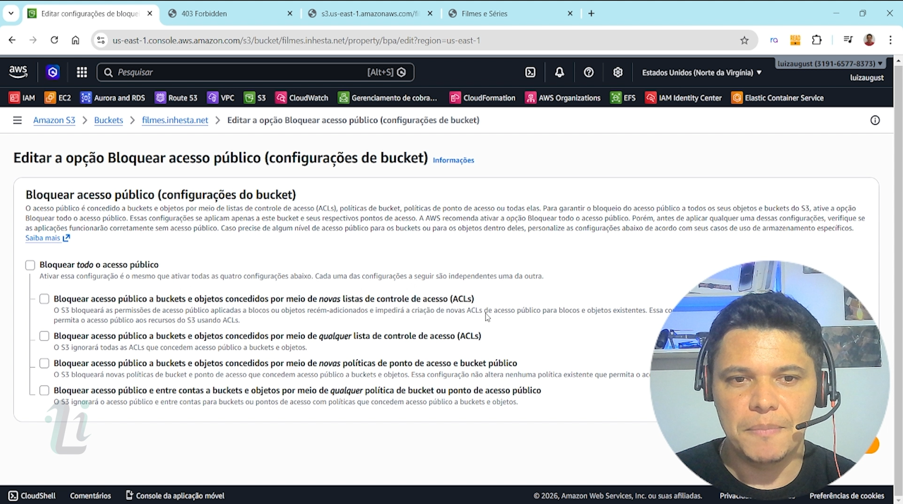
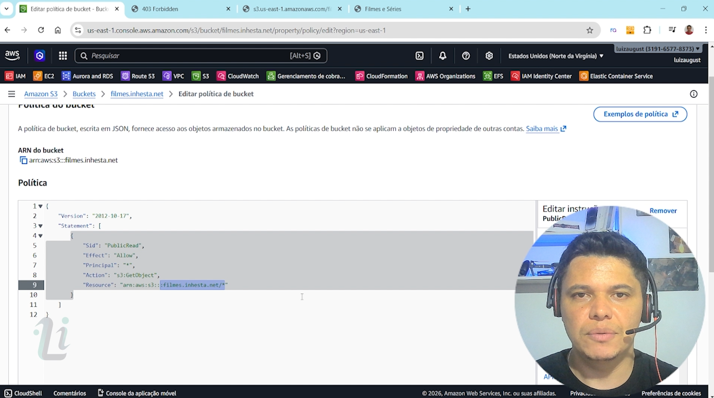

# 🚀 Hospedando um site com S3 - Projeto AWS Filmes 1/1

## 📌 Sobre o Projeto

Este projeto demonstra, na prática, como realizar a **hospedagem de um site estático utilizando o Amazon S3**, sendo a primeira etapa de uma arquitetura completa na AWS 

A proposta é construir um ambiente real com **frontend e backend**, utilizando diversos serviços da AWS ao longo da evolução do projeto.

---

.jpg)

---

## 🎯 Objetivo

Nesta fase inicial do projeto, foram realizadas as seguintes atividades:

* Upload dos arquivos do frontend 
* Configuração de permissões de acesso 
* Publicação do site de forma pública 

.png)

---

## 🧱 Arquitetura do Projeto

Este projeto faz parte de uma arquitetura maior que envolve:

* Amazon S3
* Amazon DynamoDB
* AWS Lambda
* Amazon API Gateway
* Amazon CloudFront
* Amazon Route 53
* AWS Certificate Manager

Novos serviços podem ser adicionados conforme a evolução do projeto.

---

## ☁️ Bucket S3

O frontend foi hospedado no seguinte bucket:

**filme.inhesta.net**

Configuração aplicada nesta etapa:

* Bucket configurado como **público**
* Permissão de **leitura (GET)** liberada para acesso ao site
* Utilização do recurso **Static Website Hosting**

---

## 🔐 Política de Acesso (Bucket Policy)

Para permitir o acesso público ao conteúdo, foi aplicada a seguinte policy:

```json id="qgxt0l"
{
  "Version": "2012-10-17",
  "Statement": [
    {
      "Sid": "PublicReadGetObject",
      "Effect": "Allow",
      "Principal": "*",
      "Action": "s3:GetObject",
      "Resource": "arn:aws:s3:::filme.inhesta.net/*"
    }
  ]
}
```

---

## 📸 Fotos do Projeto

<p align="center">
  
  
  
</p>

<p align="center">
  
  
  
</p>

<p align="center">
  
  
</p>

---

## 🚀 Próximas Etapas

O projeto continuará evoluindo com a implementação dos seguintes serviços:

* Route 53 + Certificate Manager
* CloudFront + WAF
* DynamoDB
* AWS Lambda
* API Gateway

---

## ⚠️ Observação de Segurança

Nesta fase inicial, o bucket foi configurado como público para facilitar o acesso ao site.

Em ambientes produtivos, o recomendado é:

* Utilizar Amazon CloudFront para distribuição
* Configurar HTTPS com Certificate Manager 
* Restringir acesso direto ao S3
* Aplicar camadas adicionais de segurança como AWS WAF 

---

## 📚 Contexto do Projeto

Este repositório representa a **primeira etapa** da construção de um projeto completo em Cloud AWS, com foco em aprendizado prático e aplicação real.

---

## 👨‍💻 Autor

**Luiz Augusto Souza**

* 💼 LinkedIn: https://www.linkedin.com/in/luiz-inhesta-341b4b311/
* 💻 YouTube: https://youtu.be/Ip70bgLvYbM

---
